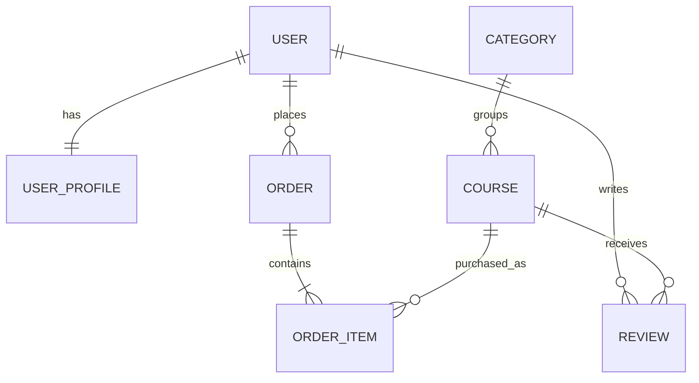

# Loaded Trading Academy

Loaded Trading Academy is a full-stack e-commerce learning platform for retail traders. It gives visitors a clear course catalogue, lets registered users purchase course access through Stripe, protects paid lesson content, and gives staff complete course-management tools.

The project was created for Code Institute Milestone Project 4. It demonstrates Django, relational data modelling, authentication and authorization, CRUD operations, Stripe Checkout, verified webhook fulfilment, responsive design, testing, and production configuration.

> **Educational use only:** Trading involves substantial risk. Course content is not financial advice.

## Live project

- Live site: to be added after deployment
- Repository: [gabriellota4-beep/loaded-trading-academy](https://github.com/gabriellota4-beep/loaded-trading-academy)

## Purpose and value

Many trading education sites focus on promises rather than process. Loaded Trading Academy is designed around three measurable pillars:

1. **Structure** — describe market conditions before forming a trade idea.
2. **Risk** — define invalidation and account exposure before entry.
3. **Execution** — follow and review a repeatable decision process.

The application provides value by keeping public discovery, secure purchase, private learning, learner feedback, and staff content management in one coherent experience.

## User experience

### Target users

- New traders who need a structured starting point.
- Developing traders who want stronger risk and execution routines.
- Academy staff who need to publish and maintain course content.

### User stories

#### Visitor

- I can understand the academy's purpose from the home page.
- I can browse and search published courses without registering.
- I can read a course description, outcomes, level, price, and reviews.
- I can register or log in before purchasing.

#### Registered learner

- I can maintain my trading profile.
- I can pay securely without card data passing through the application.
- I can see order status and order history.
- I can open lessons only for courses I own.
- I can create or update one review for an owned course.

#### Staff member

- I can create, read, update, publish/unpublish, and delete courses.
- I can maintain categories, orders, users, and reviews in Django admin.
- I can keep paid lesson content separate from public sales content.

## Design

The visual language uses a restrained dark, warm-white, and gold palette to convey focus and confidence without the visual noise common in trading products.

- `#101217` — primary ink and navigation.
- `#f5f3ee` — warm page background.
- `#d1a84b` — action and brand accent.
- Responsive card grids adapt the catalogue to desktop, tablet, and mobile.
- A JavaScript menu toggle keeps navigation usable on narrow screens.
- Semantic headings, labels, focusable links, status messages, and `aria` attributes support accessible use.

## Information architecture

- **Home** — proposition and featured courses.
- **Courses** — searchable catalogue.
- **Course detail** — public description, outcomes, price, reviews, and purchase action.
- **Lesson** — protected paid content.
- **About** — academy values and risk notice.
- **Profile** — editable learner data, owned courses, and orders.
- **Staff course management** — course CRUD.
- **Django admin** — relational back-office management.

## Data model



Key integrity rules:

- A category is protected from deletion while courses use it.
- A user can submit only one review per course.
- An order can contain a course only once.
- Orders retain their user and course references for audit history.
- Lesson access is calculated server-side from a paid order.
- Checkout-session IDs are unique and matched during fulfilment.

## Features

### Implemented

- Responsive branded home page and navigation.
- Published course catalogue with title/summary search.
- Course detail pages and learner outcomes.
- Registration, login, logout, and Django password validation.
- Unique, required registration email.
- Editable learner profile.
- Staff-only course create, edit, publish, and delete workflow.
- Stripe-hosted Checkout in test mode.
- Signature-verified Stripe webhook.
- Idempotent, server-side paid-order fulfilment.
- Protected course lessons.
- Paid-course dashboard and order history.
- Enrolled-user review create/update.
- Django admin interfaces.
- PostgreSQL production database support through `DATABASE_URL`.
- WhiteNoise static-file serving and production HTTPS settings.
- Automated model/view/security tests.
- Idempotent demonstration-content command.

### Future improvements

- Multi-lesson modules and completion tracking.
- Video hosting and downloadable learning resources.
- Refund webhook handling and automated access revocation.
- Password-reset email delivery.
- Course images stored in a cloud media service.

## Technologies

- Python 3 and Django 5.1
- HTML5 and custom CSS3
- Vanilla JavaScript
- SQLite for local development
- PostgreSQL through `dj-database-url` in production
- Stripe Checkout and webhooks
- Gunicorn and WhiteNoise
- Git and GitHub

## Security and payment design

The browser success URL never grants course access. Access is granted only after Stripe sends a `checkout.session.completed` event that:

1. passes Stripe signature verification using `STRIPE_WEBHOOK_SECRET`;
2. reports `payment_status` as `paid`;
3. contains a known order number; and
4. matches the unique Checkout Session saved on that order.

The webhook can be delivered repeatedly without creating duplicate access. Secret keys are read from environment variables and excluded from version control. Production mode enables HTTPS redirect, secure cookies, HSTS, and proxy SSL detection.

## Local installation

### Requirements

- Python 3.11 or newer
- Git
- A Stripe test account for checkout testing

### Setup

```bash
git clone https://github.com/gabriellota4-beep/loaded-trading-academy.git
cd loaded-trading-academy
python -m venv .venv
source .venv/bin/activate
pip install -r requirements.txt
```

On Windows PowerShell, activate with:

```powershell
.venv\Scripts\Activate.ps1
```

Copy `.env.example` values into your terminal or local environment manager. Never commit actual keys.

Run the database setup and create demonstration courses:

```bash
python manage.py migrate
python manage.py seed_courses
python manage.py createsuperuser
python manage.py runserver
```

Open `http://127.0.0.1:8000/`.

## Environment variables

| Variable | Purpose |
|---|---|
| `SECRET_KEY` | Long unpredictable Django signing key |
| `DEBUG` | `True` locally; `False` in production |
| `ALLOWED_HOSTS` | Comma-separated production hostnames |
| `DATABASE_URL` | Production PostgreSQL connection string |
| `STRIPE_PUBLIC_KEY` | Stripe publishable test key |
| `STRIPE_SECRET_KEY` | Stripe secret test key |
| `STRIPE_WEBHOOK_SECRET` | Signing secret for the deployed webhook endpoint |
| `CSRF_TRUSTED_ORIGINS` | Comma-separated HTTPS production origins |

## Stripe test setup

1. Use Stripe **test mode** keys.
2. Create a webhook endpoint pointing to `https://YOUR-DOMAIN/checkout/webhook/`.
3. Subscribe it to `checkout.session.completed`.
4. Store its signing secret as `STRIPE_WEBHOOK_SECRET`.
5. Use Stripe's documented test card `4242 4242 4242 4242`, any future expiry, any CVC, and a valid postal code.

For local webhook testing with the Stripe CLI:

```bash
stripe listen --forward-to localhost:8000/checkout/webhook/
```

## Deployment

The included `Procfile` runs Gunicorn and the settings automatically use PostgreSQL when `DATABASE_URL` exists.

Heroku-compatible deployment steps:

1. Create an application and attach a PostgreSQL database.
2. Add every environment variable from the table above, with `DEBUG=False`.
3. Set `ALLOWED_HOSTS` to the deployed hostname.
4. Set `CSRF_TRUSTED_ORIGINS` to the full deployed HTTPS origin.
5. Connect the GitHub repository and deploy the `main` branch.
6. Run `python manage.py migrate` in the deployment console.
7. Run `python manage.py seed_courses`.
8. Run `python manage.py createsuperuser` securely in the deployment console.
9. Configure the deployed Stripe webhook and add its signing secret.
10. Confirm registration, test checkout, fulfilment, protected access, responsive layout, and admin CRUD on the live site.

## Testing

Run all automated tests:

```bash
python manage.py test
python manage.py check
```

The suite verifies:

- public course browsing;
- authentication and staff authorization;
- enrolled-only lessons and reviews;
- profile learning access;
- missing Stripe configuration cleanup;
- protection against success-URL payment spoofing;
- verified webhook fulfilment;
- rejection of a mismatched Checkout Session; and
- user registration.

Full manual testing results and browser checks are documented in [TESTING.md](TESTING.md).

## Agile development

The implementation was divided into user-focused milestones:

1. Project structure, apps, models, and migrations.
2. Authentication, catalogue, profile, and CRUD.
3. Checkout and relational order history.
4. Secure webhook fulfilment and paid access.
5. Original content, responsive UX, tests, documentation, and deployment preparation.

## Known issues

- Payment confirmation can take a few seconds because access waits for Stripe's webhook. The success page explains the processing state.
- Courses currently contain one protected text lesson each; module progress is planned as a future enhancement.

## Credits

### Content

All academy copy, demonstration course material, and application code were created for this project. The private Code 4 trading methodology is not published in the demonstration content.

### Documentation and libraries

- [Django documentation](https://docs.djangoproject.com/)
- [Stripe Checkout and webhook documentation](https://docs.stripe.com/checkout)
- [WhiteNoise documentation](https://whitenoise.readthedocs.io/)
- [dj-database-url](https://github.com/jazzband/dj-database-url)

No external images are currently used. No card data is stored by the application.

## Author

Gabriel Lota — creator of Loaded Trading Academy.
